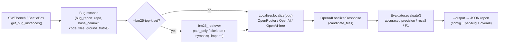
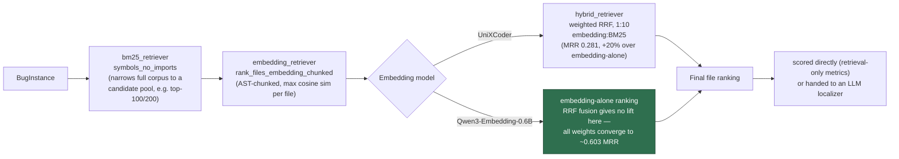
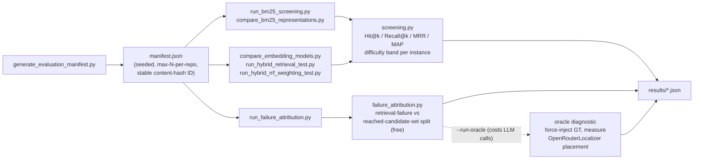

# Architecture

Four views: package dependencies (what imports what), the current `main.py` end-to-end runtime path, the validated hybrid retrieval pipeline that supersedes it (not yet merged), and the offline evaluation/diagnostics path. Complements the file-by-file breakdown in [project_structure.md](project_structure.md).

**Status note (2026-08-12)**: `main.py` itself still only wires up BM25 retrieval + a direct-pick LLM localizer (Figure 2) — none of the embedding/hybrid/FAISS work below has been merged to `main` yet, despite being validated for weeks. It lives on `research/embedding-model-bakeoff`, `research/qwen3-rrf`, `feature/repository-vector-index`, and siblings. Figure 3 shows that separate, more capable pipeline as it actually runs today via the standalone `scripts/run_hybrid_*` tools.

## Figure 1 — Package dependencies

```mermaid
graph TB
    subgraph dataset["dataset/ (self-contained)"]
        base[base.py]
        swebench[swebench.py]
        beetlebox[beetlebox.py]
        models[models.py]
        repo_cache[repo_cache.py]
        utils_d[utils.py]
        localizability[localizability.py]
    end

    subgraph method["method/ (depends on dataset only)"]
        base_m[base.py]
        openrouter["openrouter_localizer.py\n(+ optional reasoning step)"]
        openai_l[openai_localizer.py]
        openai_free[openai_free_localizer.py]
        opensource["opensource_localizer.py (disabled)"]
        rag["rag_localizer.py (dead code)"]
        bm25["bm25_retriever.py"]
        embedding["embedding_retriever.py\n(6 models incl. Qwen3-Embedding-0.6B)"]
        hybrid["hybrid_retriever.py\n(weighted RRF fusion)"]
        repoindex["repository_index.py\n(FAISS persistent index)"]
        fusion["fusion_signals.py\n(AST / dep-graph / commit-recency)"]
        graphmod["graph_retriever.py\n(2-hop BFS import graph)"]
        prompt[prompt.py]
        evaluate[evaluate.py]
        llm[llm.py]
        utils_m[utils.py]
    end

    subgraph evaluation["evaluation/ (depends on dataset + method.bm25_retriever)"]
        manifest[manifest.py]
        screening[screening.py]
        failure_attribution[failure_attribution.py]
    end

    subgraph entry["Entry points (depend on everything below them)"]
        main_py[main.py]
        scripts["scripts/*.py"]
    end

    swebench --> base
    beetlebox --> base
    swebench --> models
    beetlebox --> models
    swebench --> utils_d
    beetlebox --> utils_d
    utils_d --> repo_cache
    localizability --> utils_d

    openrouter --> base_m
    openrouter --> prompt
    openrouter --> rag
    openrouter --> utils_m
    openai_l --> base_m
    openai_l --> prompt
    openai_l --> llm
    openai_free --> base_m
    openai_free --> prompt
    openai_free --> llm
    bm25 --> repo_cache
    embedding --> bm25
    embedding --> repo_cache
    hybrid --> bm25
    hybrid --> embedding
    repoindex --> repo_cache
    repoindex --> bm25
    repoindex --> embedding
    fusion --> repo_cache
    fusion --> bm25
    fusion --> repoindex
    graphmod --> repo_cache
    utils_m --> utils_d
    method --> utils_d

    screening --> bm25
    screening --> localizability
    failure_attribution --> localizability
    failure_attribution -.->|prepare_oracle_candidate_set only| bm25
    manifest --> utils_d

    main_py --> swebench
    main_py --> beetlebox
    main_py --> openrouter
    main_py --> openai_l
    main_py --> openai_free
    main_py --> bm25
    main_py --> evaluate

    scripts --> dataset
    scripts --> evaluation
    scripts -.->|run_failure_attribution --run-oracle only| openrouter

    style opensource fill:#666,stroke:#333,color:#ccc
    style rag fill:#666,stroke:#333,color:#ccc
    style embedding fill:#2f6f4f,stroke:#1a3f2c,color:#fff
    style hybrid fill:#2f6f4f,stroke:#1a3f2c,color:#fff
    style repoindex fill:#2f6f4f,stroke:#1a3f2c,color:#fff
    style fusion fill:#8a5a2b,stroke:#5c3b1a,color:#fff
    style graphmod fill:#8a5a2b,stroke:#5c3b1a,color:#fff
```

**Legend**: grey = disabled/dead code, predates this phase of the project. **Green = validated, real, but still unmerged to `main`** (embedding retrieval, RRF fusion, the FAISS persistent index — the strongest results in the project live here). **Amber = tried, evaluated, closed as an informative negative result** (AST-similarity/dependency-graph/commit-recency fusion signals underperformed embedding-alone; 2-hop import-graph traversal regressed Hit@100) — kept in the tree for reference, not adopted into the recommended path.

**Layering is still strict and one-directional**: `dataset` never imports `method` or `evaluation`; `method` never imports `evaluation`. `evaluation` is the only package that reaches into `method` (just `bm25_retriever`, to screen candidate rankings). `main.py` and `evaluation` remain siblings — `main.py` never imports `evaluation`.

## Figure 2 — Runtime data flow: `main.py` end-to-end path (current production path)

Candidate file content, when a BM25 content-based variant is used, comes from `dataset/repo_cache.py`'s offline bare-clone cache (`get_file_contents_batch`) if the repo is locally mirrored, falling back to path-only tokens rather than a live network call. This path has no embedding/FAISS step at all — that's Figure 3.

## Figure 3 — Validated hybrid retrieval pipeline (`research/qwen3-rrf`, not yet in `main.py`)

**Headline finding**: Qwen3-Embedding-0.6B alone (0.603 MRR, n=6 local) beats UniXCoder's best-ever fused result (0.281 MRR) by more than 2x — the biggest single result in the project so far. An n=30 confirmation run was submitted to MN5 as a real Slurm job; see `docs/mn5_execution_handbook.md` / `docs/qwen3_rrf_result.md` for the outcome. A separate FAISS-backed persistent index (`method/repository_index.py`, `feature/repository-vector-index`) implements the same chunked-embedding step with on-disk caching/dedup instead of recomputing embeddings per run, verified end-to-end on a real 144-file repo (81s build, 0.16s/search after).

### Branches tried against this pipeline, and their verdict

| Branch | Idea | Result |
|---|---|---|
| `research/hybrid-fusion-signals` | Add AST-similarity, 1-hop dependency-graph, commit-recency as extra RRF signals | **Negative** — each signal individually weak (0.02–0.06 MRR); naive fusion drags the strong embedding signal down (0.419 embedding-alone vs. 0.124 five-signal hybrid at n=6) |
| `research/graph-traversal` | Real 2-hop BFS over the import graph, seeded from BM25 | **Negative** — MRR roughly flat (0.163→0.158) but Hit@100 regresses 0.867→0.733; import connectivity is a weak relevance proxy in this codebase style |
| `research/reasoning-rerank` | LLM writes bug-specific reasoning per candidate before ranking (RGFL-style) | **Negative** — worse than direct-pick baseline both tries (36.7%→30.0%→23.3%); final ranking wasn't reliably grounded in the reasoning text in this single-call design |

## Figure 4 — Offline evaluation / diagnostics path (`scripts/`)

`screening.py` and `failure_attribution.py` both depend on `dataset/localizability.py` to exclude ground-truth files introduced by the fix itself (`added_by_fix`) from being counted as retrieval misses — shared infrastructure across every diagnostic script, not duplicated per-script logic.
