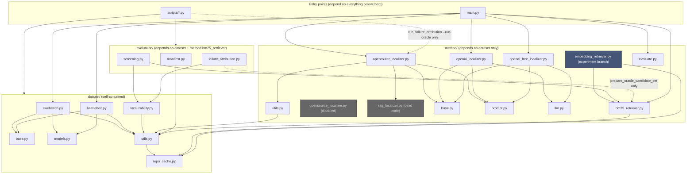
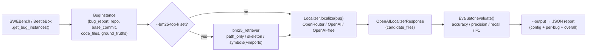
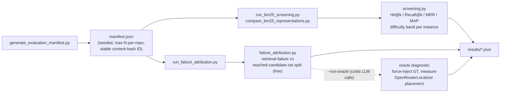

# Architecture

Two views: package dependencies (what imports what) and runtime data flow (how a bug instance actually moves through the system). Complements the file-by-file breakdown in [project_structure.md](project_structure.md).

## Package dependencies

Grey = disabled/dead code. Blue = lives only on the `experiment/embedding-ceiling` branch, not `main`.

**Layering is strict and one-directional**: `dataset` never imports `method` or `evaluation`; `method` never imports `evaluation`. `evaluation` is the only package that reaches into `method` (just `bm25_retriever`, to screen candidate rankings) — it never touches the LLM localizers directly except via the opt-in oracle diagnostic in `scripts/run_failure_attribution.py`, which imports `OpenRouterLocalizer` only when `--run-oracle` is passed. `main.py` and `evaluation` are siblings, not a hierarchy: `main.py` never imports `evaluation`, so the end-to-end pipeline and the offline diagnostics tooling can be developed and tested independently.

## Runtime data flow

### End-to-end path (`main.py`)

Candidate file content, when a BM25 content-based variant is used, comes from `dataset/repo_cache.py`'s offline bare-clone cache (`get_file_contents_batch`) if the repo is locally mirrored, falling back to path-only tokens rather than a live network call.

### Offline evaluation / diagnostics path (`scripts/`)

`screening.py` and `failure_attribution.py` both depend on `dataset/localizability.py` to exclude ground-truth files that were introduced by the fix itself (`added_by_fix`) from being counted as retrieval misses — this classification is shared infrastructure across every diagnostic script, not duplicated per-script logic.
