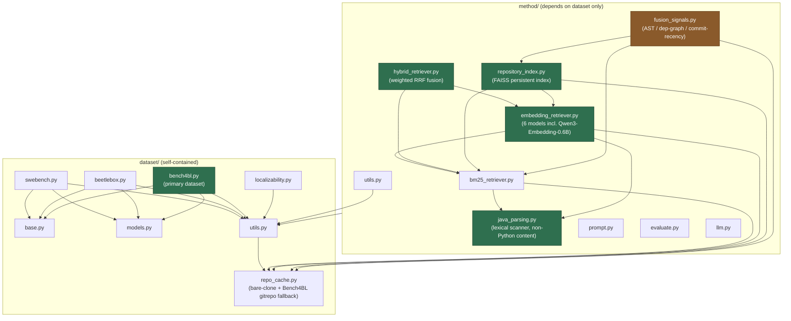
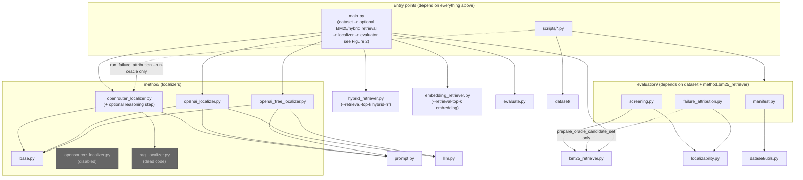
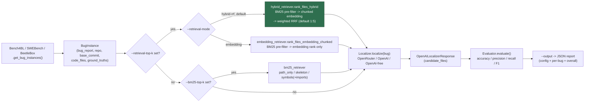
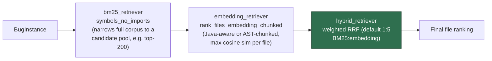
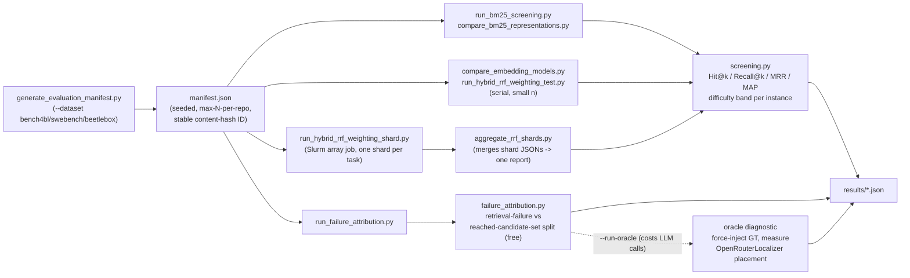

# Architecture

Four views: package dependencies (what imports what), the `main.py` end-to-end runtime path, the retrieval subsystem it calls into (BM25 + embedding + weighted RRF), and the offline evaluation/diagnostics path. Complements the file-by-file breakdown in [project_structure.md](project_structure.md).

**Status (2026-08-17)**: as of the branch merge this session, `main.py` itself wires up the full retrieval stack — dataset selection across three benchmarks (Bench4BL primary, SWE-bench and BeetleBox secondary), optional BM25-only narrowing, and optional hybrid BM25+embedding narrowing via weighted RRF — not just the standalone `scripts/run_hybrid_*` tools Figure 3 used to describe as a separate unmerged pipeline.

## Figure 1a — Dataset & retrieval methods

**Legend**: **Green = the current recommended path** — Bench4BL (primary dataset), its Java-aware lexical scanner, chunked-embedding retrieval, weighted RRF fusion, and the FAISS persistent index all merged and validated. **Amber = tried, evaluated, closed as an informative negative result** (AST-similarity/dependency-graph/commit-recency fusion signals underperformed embedding-alone) — kept in the tree for reference, not adopted into the recommended path. `graph_retriever.py` (2-hop import-graph traversal) from Figure 1's earlier version has been removed here — that branch (`research/graph-traversal`) was never merged and the file doesn't exist on `main`; see the branch table below Figure 3 for its (also negative) result.

## Figure 1b — Localizers, evaluation & entry points

**Layering is still strict and one-directional**: `dataset` never imports `method` or `evaluation`; `method` never imports `evaluation`. `evaluation` is the only package that reaches into `method` (just `bm25_retriever`, to screen candidate rankings). `main.py` and `evaluation` remain siblings — `main.py` never imports `evaluation`.

## Figure 2 — Runtime data flow: `main.py` end-to-end path

Candidate file content, for any BM25/embedding step, comes from `dataset/repo_cache.py`'s offline cache (`get_file_contents_batch`) — the bare-clone mirror for SWE-bench/BeetleBox, or Bench4BL's own working-tree `gitrepo/` as a fallback — never a live network call. `--retrieval-top-k` and `--bm25-top-k` are mutually exclusive; `--retrieval-top-k` takes precedence if both are passed. See Figure 3 for what happens inside the `hybrid_retriever`/`embedding_retriever` boxes.

## Figure 3 — Retrieval subsystem detail: BM25 + embedding + weighted RRF

**Confirmed at n=30 with Qwen3-Embedding-0.6B on two benchmarks** — weighted RRF beats embedding-alone on both, peaking at the same 1:5 ratio:

| Benchmark | BM25 alone | Embedding alone | RRF 1:5 (best) |
|---|---:|---:|---:|
| Bench4BL (primary) | MRR 0.143 | MRR 0.688 | **MRR 0.714** |
| SWE-bench Verified | MRR 0.086 | MRR 0.316 | **MRR 0.422** |

Bench4BL's 0.714 MRR is the strongest confirmed result in the project. (An earlier n=6 Bench4BL sanity check had shown unweighted RRF 1:1 winning instead — that ordering didn't survive n=30, the same small-sample pattern already seen once with SWE-bench's own n=6→n=30 transition. See `docs/bench4bl_result.md` / `docs/qwen3_rrf_result.md` for full detail, including the void pre-fix numbers this replaced.) BeetleBox has a confirmed BM25 representation comparison (`symbols_with_imports` best, MRR 0.500 at n=15) but no hybrid RRF run yet.

A separate FAISS-backed persistent index (`method/repository_index.py`, merged) implements the same chunked-embedding step with on-disk caching/dedup instead of recomputing embeddings per run, verified end-to-end on a real 144-file repo (81s build, 0.16s/search after). Real per-instance Java-aware chunking on Bench4BL is slow enough (~900s/instance) that n=30-scale runs go through Slurm array-job sharding (`scripts/run_hybrid_rrf_weighting_shard.py` + `scripts/aggregate_rrf_shards.py`) rather than one long serial job — see Figure 4.

### Branches tried against this pipeline, and their verdict

| Branch | Idea | Result |
|---|---|---|
| `research/hybrid-fusion-signals` (merged) | Add AST-similarity, 1-hop dependency-graph, commit-recency as extra RRF signals | **Negative** — each signal individually weak (0.02–0.06 MRR); naive fusion drags the strong embedding signal down |
| `research/graph-traversal` (not merged, kept separate) | Real 2-hop BFS over the import graph, seeded from BM25 | **Negative** — MRR roughly flat (0.163→0.158) but Hit@100 regresses 0.867→0.733; import connectivity is a weak relevance proxy in this codebase style |
| `research/reasoning-rerank` (not merged, kept separate) | LLM writes bug-specific reasoning per candidate before ranking (RGFL-style) | **Negative** — worse than direct-pick baseline both tries (36.7%→30.0%→23.3%); final ranking wasn't reliably grounded in the reasoning text in this single-call design |
| `experiment/embedding-ceiling` (not merged, kept separate) | Whole-file embedding vs. BM25, no chunking | **Negative** — a clean, documented dead end |

## Figure 4 — Offline evaluation / diagnostics path (`scripts/`)

`run_hybrid_rrf_weighting_shard.py`/`aggregate_rrf_shards.py` exist specifically because real per-instance Java-aware chunking on Bench4BL is too slow for one long serial MN5 job (~900s/instance would mean hours for n=30, with no output until the very end if it's killed partway) — the array-job path splits the manifest into shards run in parallel, each writing its own JSON atomically. `scripts/mirror_bench4bl.py` (not shown above, upstream of the manifest step) mirrors Bench4BL's per-project SourceForge archives into `bench4bl_cache/`.
